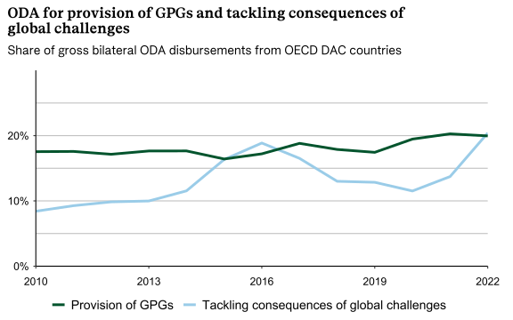
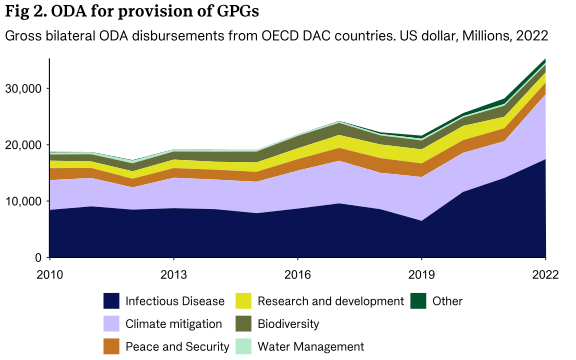
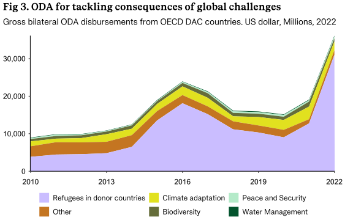

# Measuring ODA for provision of GPGs and Efforts to Tackle Consequences of Global Challenges

## Methodology

To measure bilateral ODA for promoting GPGs and tackling consequences of
global challenges we have drawn inspiration from existing methodologies
by [Development
Initiatives](https://devinit.org/wp-content/uploads/2016/07/Measuring-aid-to-global-public-goods-GPGs-Discussion-paper-July-2016.pdf)
and the
[OECD](https://www.oecd.org/en/publications/development-co-operation-and-the-provision-of-global-public-goods_aff8cba9-en.html)
to measure development finance for global public goods. Our approach is
somewhat narrower in focus on global public goods. Additionally, we
emphasize the distinction between provision of GPGs and for tackling the
consequences of global challenges. This exercise is not precise, but we
have made an approximate classification.

The data for this exercise is based on the OECD DAC’s CRS data,[^1]
which provides an overview of DAC countries’ bilateral ODA. To identify
the relevant activities in the CRS database, we use a range of sector
codes and Rio markers. We have used the CRS sector codes to categorize
activities for the provision of GPGs and for tackling consequences of
global challenges, and the categorisation is available
[here](https://github.com/noradno/global_public_goods/blob/main/data/processed/sector_codes_gpg_mapping.csv).

In addition to sector codes, we have used the OECD Rio markers for
Climate Change Adaptation, Climate Change Mitigation, and Biodiversity.
These are activities not already included using the sector codes.

- Activities with Climate change adaptation as a principal objective is
  included as tackling consequences of global challenges.

- Activities with Climate change mitigation as a principal objective is
  included as promoting GPGs

- Activities with Bio-diversity as principal objective in DAC sector
  41010 General Environmental Protection is included as GPG promotion.

In <a href="#fig-2" class="quarto-xref">Figure 2</a> and
<a href="#fig-3" class="quarto-xref">Figure 3</a>, we have created
grouped categories for contributions for provision of GPGs and tackling
the consequences of global challenges. We have ensured that there is no
overlap of activities between the two figures, and within each figure,
overlapping activities do not involve double counting of funds. In
<a href="#fig-2" class="quarto-xref">Figure 2</a> for example, there is
for example some overlap between the categories of Climate Mitigation
and Biodiversity, and we have chosen to register such activities as a
contribution to Climate Mitigation.

The categories Peace and Security and Biodiversity appear in both
<a href="#fig-2" class="quarto-xref">Figure 2</a> and
<a href="#fig-3" class="quarto-xref">Figure 3</a>. Activities in the
Peace and Security category that promote GPGs include, for example,
participation in international peacekeeping operations, while activities
addressing the consequences of global challenges include landmine
removal. In the Biodiversity category, activities promoting GPGs include
air pollution control, whereas activities addressing consequences are
more national in scope, primarily with local effects.

An important limitation of our measurement of bilateral ODA for the
provision of GPGs and addressing the consequences of global challenges
is that core support to multilateral organizations is not included.

## Main findings

In <a href="#fig-1" class="quarto-xref">Figure 1</a> we provide an
estimate of the share of bilateral ODA from OECD DAC-countries for
privision of GPGs and tackling global challenges.

The provision of GPGs has increased at the same pace as other bilateral
ODA, maintaining its share of just below 20 percent, with a slight
increase from 2019. In contrast, ODA for addressing global challenges
has increased more significantly from below 10 percent to 20 percent in
2022, and a spike in 2016.

Figure 1: ODA for provision of GPGs and tackling consequences of global
challenges

<a href="#fig-2" class="quarto-xref">Figure 2</a> and
<a href="#fig-3" class="quarto-xref">Figure 3</a> examines ODA for
provision of GPGs and tackling consequences of global challenges,
measured in amounts disbursed. From 2010 to 2018, the increase in
amounts for ODA provision was primarily driven by climate mitigation.
However, from 2019 onward, the increase has been driven by infectious
diseases.

Figure 2: ODA for provision of GPGs

As shown <a href="#fig-3" class="quarto-xref">Figure 3</a>, the
significant rise in funding to tackle the consequences of global
challenges is primarily related to refugee expenses in donor countries.
The latter is an example of expenditure that we consider as ‘tackling
the consequences of global challenges’ and not actively promoting a
solution. Nevertheless the cost related to housing refugees in donor
countries is included as GPG provision by the OECD in their working
paper from 2023. The current asylum system and quota refugee system is
both rivalrous and excludable: The vast majority of refugees are not
helped by this system, and of the very few who make it to safe
high-income countries – often as a result of a perilous journey – around
40 per cent are allowed to stay. [Latest Asylum Trends \| European Union
Agency for Asylum](https://euaa.europa.eu/latest-asylum-trends-asylum)

Figure 3: ODA for tackling consequences of global challenges

[^1]: This exercise is focused on ODA to extend the time series, but for
    more recent years, a broader focus on TOSSD could also be relevant.
